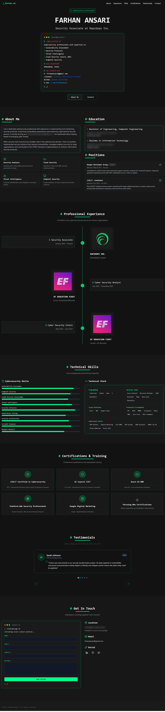

# Cybersecurity Portfolio - Farhan Ansari

A modern, responsive portfolio website built with React, TypeScript, and Tailwind CSS, designed to showcase cybersecurity skills and professional experience.

<a href="client/public/portfolio-preview.png" target="_blank">
  
</a>

## 🚀 Features

- **Modern Terminal-Inspired UI**: Terminal-like interface with cybersecurity aesthetic
- **Responsive Design**: Fully responsive layout optimized for all devices
- **Dark/Light Theme**: Toggle between dark and light modes
- **Animated Sections**: Smooth animations and transitions using Framer Motion
- **Contact Form**: Integrated contact form with Netlify Forms
- **Performance Optimized**: Fast loading times and smooth interactions
- **SEO Friendly**: Meta tags and structured data for better search engine visibility

## 🛠️ Tech Stack

- **Frontend**:
  - React
  - TypeScript
  - Tailwind CSS
  - Framer Motion (animations)
  - Tanstack Query (data fetching)
  
- **Backend**:
  - Node.js
  - Express

## 📋 Sections

- **Hero**: Introduction with terminal-inspired animation
- **About**: Professional summary and background
- **Skills**: Technical skills visualization
- **Experience**: Work history and professional experience
- **Certifications**: Professional certifications and qualifications
- **Resources**: Useful cybersecurity resources and tools
- **Testimonials**: Client and colleague feedback
- **Contact**: Contact form and information

## 🔧 Getting Started

### Prerequisites

- Node.js (v16+)
- npm or yarn

### Installation

1. Clone the repository:
   ```bash
   git clone https://github.com/fxrhan/CyberPortfolio.git
   cd CyberPortfolio
   ```

2. Install dependencies:
   ```bash
   npm install
   # or
   yarn install
   ```

3. Start the development server:
   ```bash
   npm run dev
   # or
   yarn dev
   ```

4. Open your browser and navigate to `http://localhost:5173`

## 🔄 Contact Form

The contact form is configured to work with Netlify Forms. When deployed to Netlify, form submissions will be available in the Netlify dashboard under the "Forms" tab.

## 🎨 Customization

### Theming

The site uses CSS variables for theming. Main colors and styling can be modified in:
- `client/src/index.css` - For base styling and variables
- `tailwind.config.ts` - For Tailwind CSS configuration

### Content

Update your personal information and site content in the respective component files or data files in `client/src/lib/`.


## 📞 Contact

Farhan Ansari - [fxrhanansari@gmail.com](mailto:fxrhanansari@gmail.com)

Project Link: [https://github.com/fxrhan/CyberPortfolio](https://github.com/fxrhan/CyberPortfolio)

---

Built with ❤️ by Farhan Ansari 
